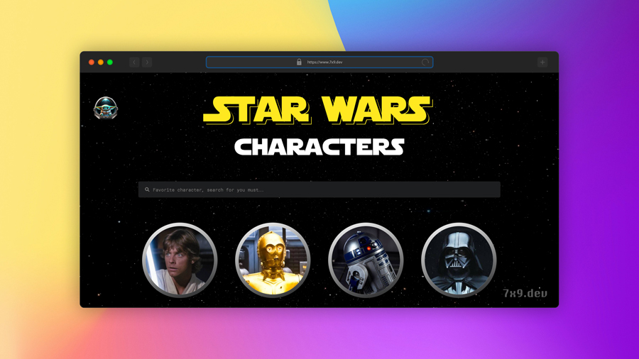

  <h1 align="center">Star Wars App</h1>
  
With You, May the React Be: Gateway to the Star Wars Universe, It Is!

  
Table of Contents

  <ol>
    <li>
      <a href="#about-the-project">About The Project</a>
      <ul>
        <li><a href="#features">Features</a></li>
        <li><a href="#built-with">Built With</a></li>
      </ul>
    </li>
    <li><a href="#getting-started">Getting Started</a></li>
    <li><a href="#api-usage">API Usage</a></li>
    <li><a href="#credits">Credits</a></li>
    <li><a href="#license">License</a></li>
    <li><a href="#acknowledgments">Acknowledgments</a></li>
  </ol>

## About The Project

   

Welcome to the Star Wars App! This simple React application fetches data from the Star Wars API (SWAPI) to provide information about characters and the movies in the Star Wars universe.

### Features

- **Character List:** Browse through a list of Star Wars characters.
- **Film List:** Explore the Star Wars movies and find out key details about each film.
- **Grogu Guidance:** Delight in the presence of the wise Grogu, who graces the page with his adorable charm and imparts nuggets of wisdom.
- **Store (Powered by Redux):** Discover a diverse collection of Star Wars-themed collectibles, curated from across the galaxy.

### Built With

- [React](https://react.dev/)
- [Swapi API](https://swapi.dev/api/)
- [React Modal](https://react-popup.elazizi.com/react-modal/)
- [React Tooltip](https://react-tooltip.com/)
- [React Router](https://reactrouter.com/en/main)
- [GSAP](https://gsap.com/)
- [Redux](https://redux.js.org/)
- [Redux Toolkit](https://redux-toolkit.js.org/)
- [React Select](https://react-select.com/)

(<a href="#readme-top">back to top</a>)

## Getting Started

1. Clone the repository.
2. Install dependencies using `npm install`.
3. Start the development server using `npm start`.

(<a href="#readme-top">back to top</a>)

## API Usage

The application uses the [SWAPI](https://swapi.dev/) to fetch data about characters and movies. You can explore the API documentation for more details.

(<a href="#readme-top">back to top</a>)

## Credits

### AI image generation

[Hotpot AI Art Generator](https://hotpot.ai/art-generator/)

### AI text generation

[ChatGPT](https://chat.openai.com/)

### Clipart

- [Official Star Wars website](https://www.starwars.com/)
- [Wallpapercosmos](https://wallpapercosmos.com/)
- [Pixabay](https://pixabay.com/)
- [Google](https://www.google.com/)

(<a href="#readme-top">back to top</a>)

## License

This project is licensed under the [MIT License](LICENSE).

**Note:**
This application includes custom design elements that are the intellectual property of the owner. The design, including but not limited to user interface components, layout, and styling, is not licensed under the MIT License. You are not allowed to copy or reuse the design elements of this application without explicit permission from the owner.

(<a href="#readme-top">back to top</a>)

## Acknowledgments

- The Star Wars API (SWAPI) for providing a rich set of data about the Star Wars universe.
- React community for creating a powerful library for building user interfaces.

Happy coding, and may the Force be with you!

(<a href="#readme-top">back to top</a>)

